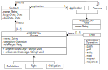

<h1 align="center">
  <br>
  
  <br>
  Jabuti DSL Grammar
  <br>
</h1>

<h4 align="center">A implementation of Jabuti DSL grammar using <a href="https://www.antlr.org/" target="_blank">ANTLR4</a></h4>

<p align="center">
    
    
    

</p>

> If you want see Jabuti DSL smart contract samples, you will find them _[here](https://github.com/gca-research-group/jabuti-ce-transformation-engine/tree/main/samples)_.

# Table of contents

- [Project papers](#project-papers)
- [Project repositories](#project-repositories)
- [Jabuti DSL metamodel](#jabuti-dsl-metamodel)
- [How To Compile](#how-to-compile)
- [Variables](#variables)
- [Dates](#dates)
- [Clauses](#clauses)
  - [Timeout](#timeout)
  - [SessionInterval](#sessioninterval)
  - [TimeInterval](#timeinterval)
  - [WeekDaysInterval](#weekdaysinterval)
  - [MaxNumberOfOperation](#maxnumberofoperation)
  - [MessageContent](#messagecontent)

## Project papers

- [Advances in a DSL to Specify Smart Contracts for Application Integration Processes](https://sol.sbc.org.br/index.php/cibse/article/view/20962)
- [On the Need to Use Smart Contracts in Enterprise Application Integration](https://idus.us.es/handle/11441/140199)
- [Jabuti CE: A Tool for Specifying Smart Contracts in the Domain of Enterprise Application Integration](https://www.scitepress.org/Link.aspx?doi=10.5220/0012413300003645)

## Project repositories

- [Smart Contract Execution Monitoring System](https://github.com/gca-research-group/smart-contract-execution-monitoring-system)
- [Hyperledger Fabric Development Network Manager](https://github.com/gca-research-group/hyperledger-fabric-development-network-manager)
- [Transformation Engine](https://github.com/gca-research-group/jabuti-ce-transformation-engine)
- [Jabuti CE (VSCode Plug-in)](https://github.com/gca-research-group/jabuti-ce-vscode-plugin)
- [Jabuti DSL Grammar](https://github.com/gca-research-group/jabuti-ce-jabuti-dsl-grammar)
- [Jabuti XText/Xtend implementation](https://github.com/gca-research-group/dsl-smart-contract-eai)

## Jabuti DSL metamodel

<p align="center">
    
</p>

## How to compile

- Requirements:

  - NodeJs +16
  - Java +11

- Clone this repository

```sh
git clone https://github.com/gca-research-group/jabuti-ce-jabuti-dsl-grammar
```

- Install the dependencies

```sh
npm install
```

- Compile the project

```sh
npm run build
```

- Packing the code

```sh
npm pack
```

## Variables

The following list describes the rules for variables allowed in the Jabuti DSL grammar:

- Alphanumeric Characters and Underscores: variable names can consist of letters (both uppercase and lowercase), digits, and underscores (\_).

- No Leading Digits: variable names cannot begin with a digit. They must start with a letter or an underscore.
  No Spaces: Variable names cannot contain spaces. Use underscores or camelCase to separate words (e.g., first_name or firstName).

- Case Sensitivity: variable names are case-sensitive. For example, variable, Variable, and VARIABLE are three different variables.

- Reserved Words: Jabuti DSL grammar keywords cannot be used as variables

The following are examples with correct and incorrect variable names:

- <span style="color: green">&check;</span> **var1**
- <span style="color: green">&check;</span> **var_1**
- <span style="color: green">&check;</span> **Var1**
- <span style="color: green">&check;</span> **var_1**
- <span style="color: green">&check;</span> **variable**
- <span style="color: green">&check;</span> **\_variable**
- <span style="color: red">&cross;</span> **1var**
- <span style="color: red">&cross;</span> **1_var**
- <span style="color: red">&cross;</span> **123**

## Dates

Jabuti DSL dates follow the <a href="https://www.iso.org/iso-8601-date-and-time-format.html" target="_blank">ISO-8601</a> standard. A date can only contain year, month and day, just as it can contain hours, seconds and milliseconds.

The following are examples with correct and incorrect dates:

- <span style="color: green">&check;</span> **1900-01-01**
- <span style="color: green">&check;</span> **1900-01-01 00:00**
- <span style="color: green">&check;</span> **1900-01-01 00:00:00**
- <span style="color: green">&check;</span> **1900-01-01 00:00:00.000**
- <span style="color: red">&cross;</span> **01/01/1900**

## Clauses

Clauses can be of three types: rigth, obligation, and prohibition. A clause require a rolePlayer, the executor, an operation, and terms. A clause can also trigger an event.

RolePlayer can be:

- process
- application

Operation can be:

- request
- response
- write
- pull
- push
- poll

Terms can be:

- [Timeout](#timeout)
- [SessionInterval](#sessioninterval)
- [TimeInterval](#timeinterval)
- [WeekDaysInterval](#weekdaysinterval)
- [MaxNumberOfOperation](#maxnumberofoperation)
- [MessageContent](#messagecontent)

Event can be:

- onBreach: is trigered if the clause is violated
- onSuccess: is trigered if the clause execution is successful

Excerpt of clauses:

```
clauses {
  // the clause type can be rigth, obligation, or prohibition
  rigth clause1 {
    rolePlayer = application
    operation = request

    terms {

    }

    onBreach(log("on breanch clause 1"))
    onSuccess(log("on success clause 1"))
  }
}
```

### Timeout

Represents the maximum time in seconds that a response operation can take. Timeout can only be used in clauses whose operation is equal to response.

```
operation = response

terms {
  Timeout(150)
}
```

### SessionInterval

Specifies the number of sessions allowed for a period of time.

```
SessionInterval(1 per Day)
```

Allowed intervals:

- Second
- Minute
- Day
- Week
- Month

### TimeInterval

Defines an interval in which an integration should happen. The interval needs to be a valid hour.

```
TimeInterval(00:00:00 to 08:00:00)
```

Allowed patterns:

- HH:MM
- HH:MM:SS

### WeekDaysInterval

Represents an interval during the week in which the integration should occur.

```
WeekDaysInterval(Monday to Wednesday)
```

Days of week can be:

- Monday
- Tuesday
- Wednesday
- Thursday
- Friday
- Saturday
- Sunday

### MaxNumberOfOperation

Number of operations per unit of time

```
MaxNumberOfOperation(5 per Second)
```

The unit of time can be:

- Second
- Hour
- Minute
- Day
- Week
- Month

### MessageContent

Extracts the content of the message payload.

```jabuti
// Using xpath
MessageContent("//root/name")

// Using jsonpath
MessageContent("$.[*].name")

// Using variable
MessageContent(var1 > 100)

// Using value of xpath/jsonpath to evaluate a expression
MessageContent("xpath" > 100)

// Using value of xpath/jsonpath to evaluate a period of execution
MessageContent("xpath" <= 5000 per Month)
```

## License

This project is licensed under the MIT License. See the [LICENSE](LICENSE) file for details.

## Contact

For any questions or issues, please open an issue on GitHub or contact the maintainers.
