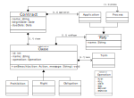

<h1 align="center">
  <br>
  
  
  <br>
  Jabuti DSL Grammar
  <br>
</h1>

<h4 align="center">A implementation of Jabuti DSL grammar using <a href="https://www.antlr.org/" target="_blank">ANTLR4</a>.</h4>

<p align="center">
    
    
</p>

# Table of content
- [Jabuti project papers](#jabuti-project-papers)
- [Jabuti projetct repositories](#Jabuti-projetct-repositories)
- [Jabuti DSL metamodel](#jabuti-dsl-metamodel)
- [Variables](#variables)
- [Dates](#dates)
- [Clauses](#clauses)
  - [Timeout](#timeout)
  - [SessionInterval](#sessioninterval)
  - [TimeInterval](#timeinterval)
  - [WeekDaysInterval](#weekdaysinterval)
  - [MaxNumberOfOperation](#maxnumberofoperation)
  - [MessageContent](#messagecontent)

## Jabuti project papers
- [Advances in a DSL to Specify Smart Contracts for Application Integration Processes](https://sol.sbc.org.br/index.php/cibse/article/view/20962)
- [On the Need to Use Smart Contracts in Enterprise Application Integration](https://idus.us.es/handle/11441/140199)
- [Jabuti CE: A Tool for Specifying Smart Contracts in the Domain of Enterprise Application Integration](https://www.scitepress.org/Link.aspx?doi=10.5220/0012413300003645)

## Jabuti projetct repositories
- VSCode based projects
  - [Jabuti DSL Grammar](https://github.com/gca-research-group/jabuti-ce-jabuti-dsl-grammar)
  - [Transformation Engine](https://github.com/gca-research-group/jabuti-ce-transformation-engine)
  - [VSCode Plugin](https://github.com/gca-research-group/jabuti-ce-vscode-plugin)
- XText based project
  - [XText/Xtend implementation](https://github.com/gca-research-group/dsl-smart-contract-eai)

## Jabuti DSL metamodel
<p align="center">
    
</p>

## Variables

The following list describes the rules for variables allowed in the Jabuti DSL grammar:

- Alphanumeric Characters and Underscores: variable names can consist of letters (both uppercase and lowercase), digits, and underscores (_).

- No Leading Digits: variable names cannot begin with a digit. They must start with a letter or an underscore.
No Spaces: Variable names cannot contain spaces. Use underscores or camelCase to separate words (e.g., first_name or firstName).

- Case Sensitivity: variable names are case-sensitive. For example, variable, Variable, and VARIABLE are three different variables.

- Reserved Words: Jabuti DSL grammar keywords cannot be used as variables

The following are examples with correct and incorrect variable names:

- <span style="color: green">&check;</span> **var1**
- <span style="color: green">&check;</span> **var_1**
- <span style="color: green">&check;</span> **Var1**
- <span style="color: green">&check;</span> **var_1**
- <span style="color: green">&check;</span> **variable**
- <span style="color: green">&check;</span> **_variable**
- <span style="color: red">&cross;</span> **1var**
- <span style="color: red">&cross;</span> **1_var**
- <span style="color: red">&cross;</span> **123**


## Dates

Jabuti DSL dates follow the <a href="https://www.iso.org/iso-8601-date-and-time-format.html" target="_blank">ISO-8601</a> standard. A date can only contain year, month and day, just as it can contain hours, seconds and milliseconds.

The following are examples with correct and incorrect dates:

- <span style="color: green">&check;</span> **1900-01-01**
- <span style="color: green">&check;</span> **1900-01-01 00:00**
- <span style="color: green">&check;</span> **1900-01-01 00:00:00**
- <span style="color: green">&check;</span> **1900-01-01 00:00:00.000**
- <span style="color: red">&cross;</span> **01/01/1900**

## Clauses

Clauses can be of three types: rigth, obligation and prohibition. A clause require a rolePlayer, the executor, an operation and terms.

RolePlayer can be:
- process
- application

Operation can be:
- request
- response
- write
- pull
- push
- poll

Terms can be:
- [Timeout](#timeout)
- [SessionInterval](#sessioninterval)
- [TimeInterval](#timeinterval)
- [WeekDaysInterval](#weekdaysinterval)
- [MaxNumberOfOperation](#maxnumberofoperation)
- [MessageContent](#messagecontent)

Excerpt of clauses:
```
clauses {
  rigth clause1 {
    rolePlayer = application
    operation = request
    terms {

    }
  }

  obligation clause1 {
    rolePlayer = application
    operation = request
    terms {

    }
  }

  prohibition clause1 {
    rolePlayer = process
    operation = request
    terms {

    }
  }

}
```

### Timeout

Represents the maximum time in seconds that a response operation can take. Timeout can only be used in clauses whose operation is equal to response.

```
operation = response

terms {
  Timeout(150)
}
```

### SessionInterval

```
SessionInterval(1 per Day)
```

Allowed intervals:
- Second
- Minute
- Day
- Week
- Month

### TimeInterval
Defines an interval that a integration should happens. The interval needs be a valid hour.

```
TimeInterval(00:00:00 to 08:00:00)
```

Allowed patterns:
- HH:MM
- HH:MM:SS

### WeekDaysInterval
Represents an interval during the week at which integration should occur.

```
WeekDaysInterval(Monday to Wednesday)
```

Days of week can be:
- Monday
- Tuesday
- Wednesday
- Thursday
- Friday
- Saturday
- Sunday

### MaxNumberOfOperation
Number of operations per unit of time

```
MaxNumberOfOperation(5 per Second)
```

The unit of time can be:
- Second
- Hour
- Minute
- Day
- Week
- Month

### MessageContent
Extracts the content of the message payload.

```jabuti
// Using xpath
MessageContent("//root/name")

// Using jsonpath
MessageContent("$.[*].name")

// Using variable
MessageContent(var1 > 100)

// Using value of xpath/jsonpath to evaluate a expression
MessageContent("xpath" > 100)

// Using value of xpath/jsonpath to evaluate a period of execution
MessageContent("xpath" <= 5000 per Month)
```

## How to compile
- Requirements:
  - NodeJs +16
  - Java +11
- Execute the command `yarn build`

## License

Copyright © 2023 [The Applied Computing Research Group (GCA)](https://github.com/gca-research-group).<br />
This project is [MIT](https://github.com/gca-research-group/jabuti-dsl-language-antlr/blob/master/LICENSE) licensed.
